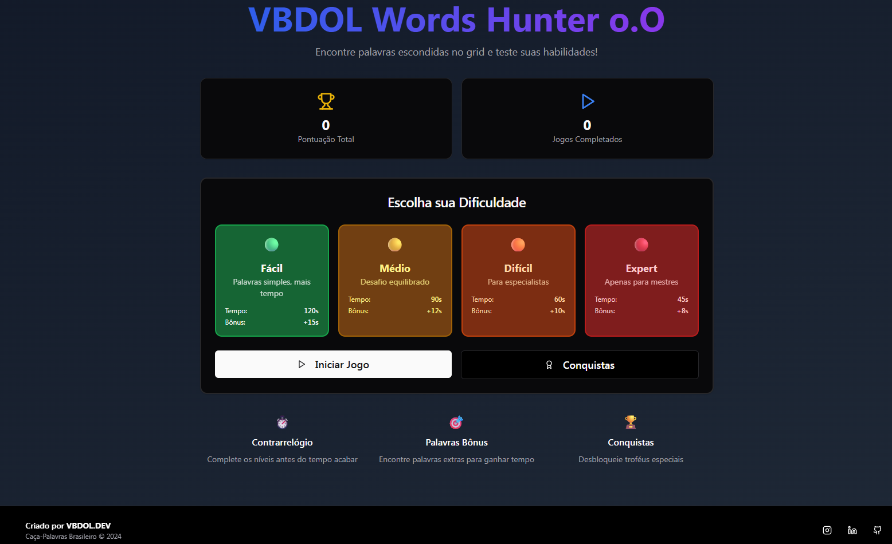

# VBDOL Words Hunter

 <!-- Substitua pelo caminho da sua imagem -->

## Descrição

VBDOL Words Hunter é um jogo de caça-palavras brasileiro desenvolvido com React, TypeScript e Tailwind CSS. O objetivo é encontrar todas as palavras escondidas no grid antes que o tempo acabe, desbloqueando conquistas e acumulando pontos.

## Funcionalidades

- **Jogo de Caça-Palavras** com palavras em português.
- **Sistema de Dificuldade**: fácil, médio, difícil e expert.
- **Palavras Bônus**: encontre palavras extras para ganhar tempo.
- **Sistema de Conquistas**: mais de 50 conquistas para desbloquear.
- **Ranking de Pontuação** e estatísticas de jogos.
- **Interface Responsiva** e modo escuro.
- **Compartilhamento Social**: links para Instagram, LinkedIn e GitHub.

## Estrutura do Projeto

```
.
├── client/
│   ├── index.html
│   ├── public/
│   └── src/
│       ├── App.tsx
│       ├── index.css
│       ├── main.tsx
│       └── components/
│           ├── ui/
│           └── word-search/
├── server/
│   ├── index.ts
│   └── static-serve.ts
├── scripts/
├── package.json
├── tailwind.config.js
├── tsconfig.json
└── README.md
```

## Como Rodar

1. **Instale as dependências:**

   ```sh
   npm install
   ```

2. **Inicie o servidor de desenvolvimento:**

   ```sh
   npm start
   ```

3. **Acesse no navegador:**

   ```
   http://localhost:3000
   ```

## Scripts

- `npm run build`: Compila o frontend e backend para produção.
- `npm start`: Inicia o ambiente de desenvolvimento com hot reload.

## Tecnologias Utilizadas

- [React](https://react.dev/)
- [TypeScript](https://www.typescriptlang.org/)
- [Tailwind CSS](https://tailwindcss.com/)
- [Vite](https://vitejs.dev/)
- [Express](https://expressjs.com/)

## Estrutura de Componentes

- **App.tsx**: Componente principal, gerencia rotas e contexto do jogo.
- **MainMenu**: Menu inicial com seleção de dificuldade e acesso às conquistas.
- **WordSearchGame**: Tela principal do jogo.
- **AchievementsPanel**: Exibe conquistas desbloqueadas.
- **GameHeader, Footer, DifficultySelector, LevelCompleteAnimation**: UI e controles do jogo.
- **GameContext**: Contexto global para estado do jogo e conquistas.

## Personalização

- Para alterar as palavras do jogo, edite [`wordDatabase.ts`](client/src/components/word-search/utils/wordDatabase.ts).
- Para adicionar conquistas, edite [`GameContext.tsx`](client/src/components/word-search/context/GameContext.tsx).

## Licença

MIT

---

> Desenvolvido por  [VBDOL.DEV](https://github.com/VBDOL)
